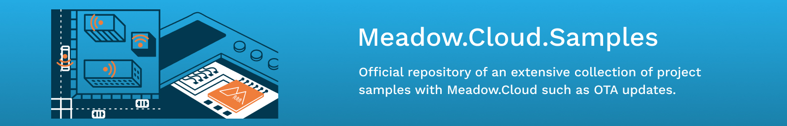
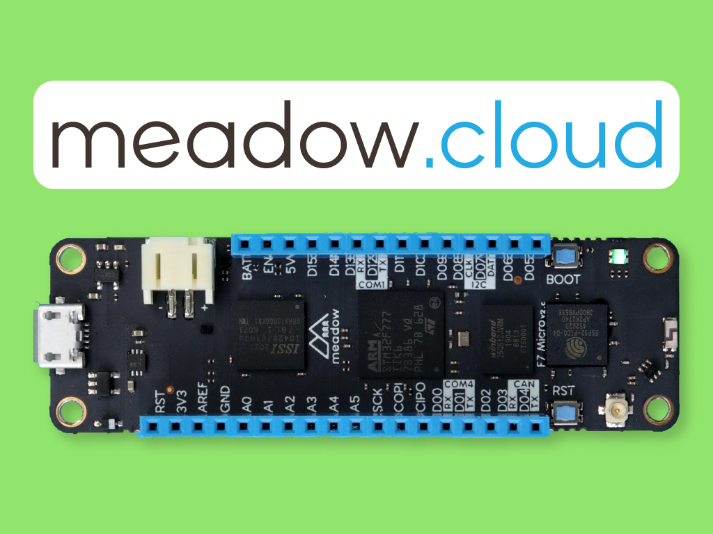
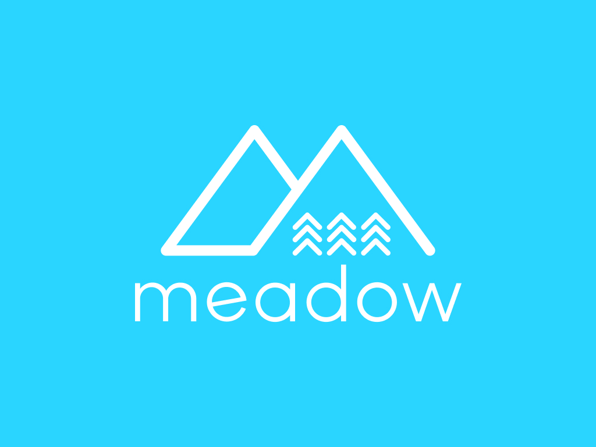
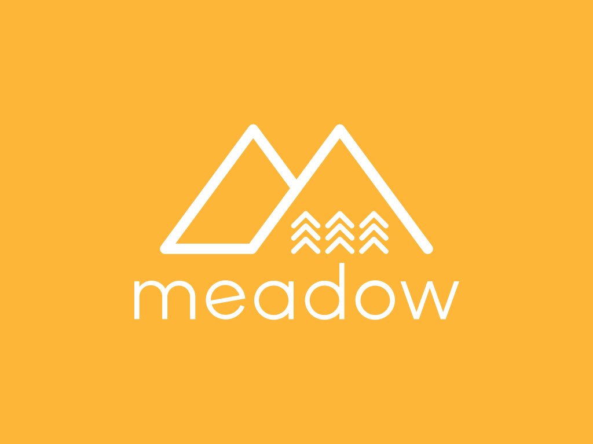

# Meadow.Cloud.Samples

Meadow.Cloud provides secure, Over-the-Air (OtA) updates, which enable you to push a new version of a Meadow application to a device in the field over the network.

## Contents
* [Getting Started](#getting-started)
* [Project Samples](#project-samples)
* [Support](#support)

## Getting Started

Before running any of the project samples below, make sure to go through the [Meadow.Cloud basics](http://developer.wildernesslabs.co/Meadow/Meadow.OS/Updates/) guides showing you how to provision your device, how to download and apply an update from Meadow, and make/publish a package. 

## Project Samples

<table>
    </tr>
        <tr>
        <td>
             
            Send an over-the-air update to change colors on an RGB LED 
            <a href="Source/Meadow.Cloud.Samples/RgbLedUpdateSample/">Source Code</a>
        </td>
        <td>
             
            Send diagnostics logs to Meadow.Cloud from a Meadow app. 
            <a href="Source/Hackster/MemoryGame/">Source Code</a>
        </td>
        <td>
             
            Send commands from Meadow.Cloud to a collection of Meadow devices. 
            <a href="Source/Hackster/MorseCodeTrainer/">Source Code</a>
        </td>
    </tr>
    <tr>
        <td>
            
&nbsp;&nbsp;&nbsp;&nbsp;&nbsp;&nbsp;&nbsp;&nbsp;&nbsp;&nbsp;&nbsp;&nbsp;&nbsp;&nbsp;&nbsp;&nbsp;&nbsp;&nbsp;&nbsp;&nbsp;&nbsp;&nbsp;&nbsp;&nbsp;&nbsp;&nbsp;&nbsp;&nbsp;&nbsp;&nbsp;&nbsp;&nbsp;

        </td>
        <td>
            
&nbsp;&nbsp;&nbsp;&nbsp;&nbsp;&nbsp;&nbsp;&nbsp;&nbsp;&nbsp;&nbsp;&nbsp;&nbsp;&nbsp;&nbsp;&nbsp;&nbsp;&nbsp;&nbsp;&nbsp;&nbsp;&nbsp;&nbsp;&nbsp;&nbsp;&nbsp;&nbsp;&nbsp;&nbsp;&nbsp;&nbsp;&nbsp;

        </td>
        <td>
            
&nbsp;&nbsp;&nbsp;&nbsp;&nbsp;&nbsp;&nbsp;&nbsp;&nbsp;&nbsp;&nbsp;&nbsp;&nbsp;&nbsp;&nbsp;&nbsp;&nbsp;&nbsp;&nbsp;&nbsp;&nbsp;&nbsp;&nbsp;&nbsp;&nbsp;&nbsp;&nbsp;&nbsp;&nbsp;&nbsp;&nbsp;&nbsp;

        </td>
    </tr>
</table>

## Support

Having trouble building/running these projects? 
* File an [issue](https://github.com/WildernessLabs/Meadow.Desktop.Samples/issues) with a repro case to investigate, and/or
* Join our [public Slack](http://slackinvite.wildernesslabs.co/), where we have an awesome community helping, sharing and building amazing things using Meadow.